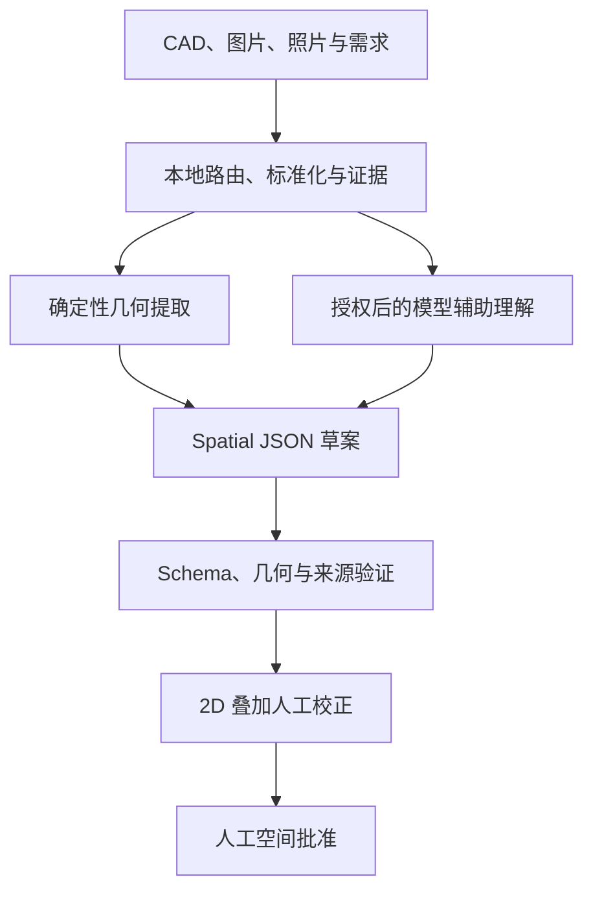
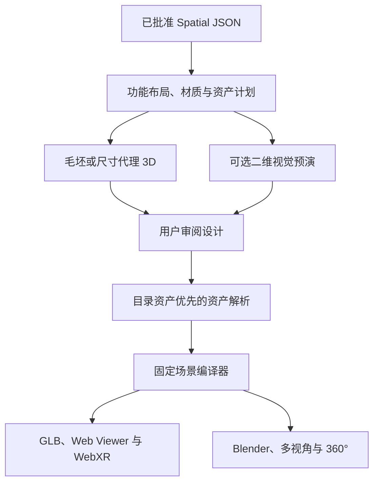

# AI VR 室内设计系统方案设计思路

## 0. 文档定位与当前状态

本文描述 VR-3D-Skill 的**最终目标架构和模块分工**，不代表文中全部能力已经实现。

- 产品范围、交付要求、开发阶段和阶段门禁以 [需求文档.md](需求文档.md) 为准。
- 当前开发阶段是 **P3：确定性毛坯建模与 GLB（IN_PROGRESS）**。
- P2 已完成；P4 及以后能力即使已有演示代码，也只能视为冻结的预研原型。
- 本仓库交付的是可被 Agent 或上层系统调用的 Skill 核心能力、确定性工具和本地 Viewer，不包含完整多租户 SaaS 所需的账号、计费、运营后台和商业管理系统。

本文只解释“最终采用什么架构实现需求”。如本文与需求文档的范围或状态冲突，以需求文档为准。

---

## 1. 项目定位

### 1.1 目标

构建一个由多模态空间推理、确定性几何处理、图像生成、3D 资产解析和 Web/VR 渲染共同组成的 AI 室内设计 Skill。

核心目标不是只生成一个看起来像房间的模型，而是把用户输入转换为：

1. 可追溯、可校正、可批准的空间事实；
2. 满足尺寸、碰撞和动线约束的设计方案；
3. 可复现、可编辑、可直接观看的 3D/VR 成果；
4. 可增量修改、可回滚、可重新验证的版本链。

### 1.2 最终输入范围

目标态支持：

- CAD：DXF、经本地转换的 DWG；
- 户型资料：PNG、JPG、JPEG、WebP、矢量 PDF、扫描 PDF；
- 室内资料：单张照片、多视角照片、视频、360°全景；
- 空间扫描：点云、深度数据、IFC/BIM；
- 现有 3D：GLB、glTF、OBJ、FBX；
- 用户要求：装修模式、风格、预算、人数、收纳、无障碍、保留物品和产品目录。

当前只有图片准备和 DXF 矢量证据路线达到 P1 范围。PDF、DWG、照片重建、IFC、点云和已有 3D 的完整语义重建属于后续阶段，不能宣传为当前已完成。

### 1.3 最终输出范围

- `Spatial JSON` 草案、验证报告、人工批准记录和修订历史；
- 毛坯房、硬装房和精装房；
- 确定性的 GLB/glTF 场景和固定 Web Viewer；
- 桌面、移动端、第一人称和 WebXR/VR 审阅；
- 多视角效果图和 2:1 等距柱状投影 360°全景；
- 可选 Blender `.blend`、OBJ、FBX、USD、Unreal 或 Twinmotion 工程；
- 资产清单、来源与许可证、尺寸、轴、枢轴和优化状态；
- 场景哈希、运行说明、测试范围、批准范围和剩余风险。

### 1.4 核心原则

- `Spatial JSON` 是唯一空间事实源。
- 模型输出只能是草案或建议，不能自行完成人工批准。
- 确定性代码负责来源保留、单位转换、验证、阶段门禁、场景编译和导出。
- 图片效果图和装饰网格不能反向覆盖已批准的墙体、门窗、尺寸和动线。
- 原始输入默认本地处理；向第三方发送前必须取得对供应商、模型和具体数据范围的明确授权。
- 无可靠尺度或来源不足的结果必须标记为 `visualization_only`，不能包装成施工成果。

---

## 2. 总体技术架构

### 2.1 空间事实建立流程



说明：

- DXF、PDF、BIM 和点云优先保留矢量或结构化信息。
- OCR 只提供文字和标注证据，不直接决定墙体几何。
- GPT-5.5 可辅助分类图层、识别语义和处理模糊输入，但不得覆盖确定性坐标和明确测量。
- 人工批准记录必须绑定源清单、Spatial JSON 和验证报告哈希。

### 2.2 设计与交付流程



这里有两个不同用途的 3D 结果：

1. **毛坯或代理场景**：在空间批准后即可生成，用于检查尺度、墙体、开口、家具占位和动线，不依赖 GPT Image 2。
2. **最终硬装或精装场景**：在设计审阅和资产解析后生成，包含已批准材质、灯光和真实资产。

二维视觉预演是可选的设计沟通手段，不是所有毛坯或几何检查任务的强制前置条件。项目可以把视觉确认设置为高成本精装资产、Blender 渲染或营销交付的门禁。

### 2.3 数据真值边界

| 数据或产物 | 可以决定 | 不可以决定 |
|---|---|---|
| 原始测量、CAD、BIM | 尺寸、坐标和明确构件 | 未标注的设计意图 |
| OCR 与图片观察 | 标签、尺寸文字和视觉线索 | 未验证的精确施工几何 |
| GPT-5.5 草案 | 空间语义、分类、假设和待确认问题 | 人工批准、结构安全和无来源尺寸 |
| Spatial JSON 批准版 | 下游空间、设计和场景事实 | 超出批准范围的施工结论 |
| GPT Image 2 效果图 | 色彩、氛围和视觉方向 | 墙体、开口、碰撞和动线真值 |
| 家具或装饰资产 | 外观、材质槽和已验证尺寸 | 房间拓扑和结构几何 |
| GLB、Blender、Viewer | 显示和交互 | 重新解释设计意图 |

---

## 3. 模块设计

### 3.1 本地输入与证据层

职责：

- 识别输入类型并选择处理路线；
- 保存原件、文件指纹、方向、单位和转换记录；
- 使用 Sharp 标准化图片；
- 使用本地 OCR 提取带位置和置信度的文本证据；
- 使用 DXF Parser 提取实体、图层、块、文字、尺寸和单位；
- 使用确定性转换器把已知 DXF 图层/实体和受支持的正交栅格外壳转换为带来源的 Spatial JSON；
- 保存原图到标准化图、标准化像素到米制空间的可逆坐标变换；
- 对不支持的格式形成明确阻断项和本地转换建议。

边界：

- 不猜测未知单位；
- 不把 OCR 文本直接转换成权威几何；
- 不因模型方便而把矢量 CAD 先栅格化；
- 不把当前只能识别的格式写成已经完成重建。

### 3.2 OpenAI 兼容网关层（RealmRouter）

RealmRouter 是当前 GPT-5.5 和 GPT Image 2 的 OpenAI 兼容接入层，负责统一鉴权、模型目录检查、请求路由、超时和重试，不拥有空间事实、设计约束或业务状态。

```dotenv
REALMROUTER_BASE_URL=https://realmrouter.cn
REALMROUTER_SPATIAL_API_KEY=
REALMROUTER_IMAGE_API_KEY=
REALMROUTER_SPATIAL_MODEL=gpt-5.5
REALMROUTER_IMAGE_MODEL=gpt-image-2
```

要求：

- 真实密钥只存在被 Git 忽略的 `.env` 中；
- 空间推理和图像生成使用独立的最小权限令牌；
- 调用前验证配置模型是否对当前令牌可见；
- 日志只记录模型、请求 ID、延迟、重试、错误码和验证结果；
- 不记录鉴权头、密钥或未授权的完整客户输入；
- 每次外部调用都必须由任务入口检查明确的供应商授权，不能绕过入口直接调用适配器。

网关和模型都应保持可配置。`gpt-5.5` 是当前默认值，不应成为 Spatial JSON 或业务状态机里的硬编码依赖。

### 3.3 空间理解层（GPT-5.5）

职责：

- 在确定性转换无法判定语义时，结合本地图片、OCR 和 CAD 证据补充 Spatial JSON 草案；
- 对模糊的 DXF 图层、块和房间语义进行辅助分类；
- 识别房间、墙体、门窗、固定设施和连接关系；
- 分析空间功能、人体尺度、主要动线和用户要求；
- 明确区分 measured、parsed、observed、inferred、generated 和 user_edited；
- 输出置信度、假设、来源冲突和待确认问题。

不得：

- 覆盖 DXF 中明确的坐标和尺寸；
- 在单位未知时自行选择单位；
- 把观察或推断包装成测量事实；
- 判断承重安全或法规合规；
- 把自己的草案标记为人工批准。

Spatial JSON 必须符合 [schemas/spatial.schema.json](schemas/spatial.schema.json) 和 [references/spatial-json-contract.md](references/spatial-json-contract.md)，不能使用只有房间名称、字符串尺寸和二维位置的简化对象替代正式契约。

### 3.4 验证、校正与人工批准层

确定性验证至少包括：

- JSON Schema、版本、单位、轴、原点和稳定 ID；
- 墙体零长度、重复、连接、自交和房间闭合；
- 门窗宿主墙、范围、高度、重叠和开启方式；
- 房间引用、面积差异和固定设施；
- 家具边界、碰撞、门扇、净空和主要动线；
- 来源冲突、低置信度拓扑和未解决问题；
- `visualization_only` 或 `construction_ready` 的批准范围。

人工校正界面最终应支持在源图上叠加标准顶视图，修正：

- 墙线和墙厚；
- 门窗位置与方向；
- 房间边界与标签；
- 尺度锚点、单位、方向和原点；
- 固定设备和不可用区域。

批准记录至少保存：

- 来源清单哈希；
- Spatial JSON 哈希；
- 验证报告哈希；
- 批准人和批准时间；
- 批准范围和备注；
- Ed25519 签名和受信审阅者密钥 ID；私钥必须位于工作区外。

没有人工批准记录时，设计、最终场景和高质量渲染必须被阻断。

### 3.5 设计与视觉预演层

设计规划在已批准空间上执行，负责：

- 功能分区和尺寸正确的家具占位；
- 人数、生活方式、预算、收纳、无障碍和保留物品；
- 门扇、固定设备、家具碰撞、净空和连续动线；
- 毛坯、硬装、精装以及多个可比较方案；
- 材质、色彩、灯光和资产意图；
- 功能、动线、收纳、采光、风格、成本和风险的可解释评分。

GPT Image 2 只负责可选的二维视觉预演：

- 室内概念效果图；
- 奶油风、胡桃木风等方案对比；
- 材质、色彩和灯光预演；
- 在用户授权的原图和蒙版上执行局部改图。

视觉预演必须绑定：

- 已批准的 Spatial JSON 修订；
- 已通过硬约束检查的明确设计修订；
- 相机和构图意图；
- 模型、请求 ID、提示来源和输出哈希。

视觉预演不得：

- 反写墙体、门窗、尺寸、家具 Transform 和动线；
- 判断结构安全、施工尺寸、碰撞和净空；
- 替代毛坯或代理 3D 的几何审阅。

### 3.6 资产解析与 3D 资产模型

每个设计对象按以下优先级解析：

1. 客户已有且获准使用的资产；
2. 授权产品目录或资产库；
3. 参数化原语或尺寸正确的代理；
4. 混元3D等模型生成的家具或装饰资产。

混元3D适合生成：

- 沙发、桌椅、床和灯具；
- 植物、壁画、摆件和装饰；
- 目录中不存在的风格化家具。

混元3D不负责：

- 墙体、门窗洞口、房间拓扑和楼层结构；
- 家具布局、动线和净空判断；
- 用视觉外观替代真实尺寸。

所有真实或生成资产都必须记录并验证：

- 来源和许可证；
- 真实尺寸和单位；
- 前向轴和向上轴；
- 枢轴和落地位置；
- 材质槽和贴图；
- 碰撞代理；
- 面数、纹理和运行时优化状态。

无效或缺失资产必须保留尺寸正确的代理和可恢复错误，不能静默消失。

### 3.7 确定性场景工程层

固定场景编译器负责把已批准 Spatial JSON 和已解析资产编译为可运行场景。

生成：

- `scene.glb` 或 `scene.gltf`；
- `scene-manifest.json`；
- 固定 Three.js Viewer；
- 来源 Spatial JSON；
- 验证报告和场景哈希；
- 毛坯、硬装或精装模式。

编译器最终需要正确处理：

- 门窗真实洞口；
- 多房间、凹房间、共享墙和墙角；
- 地面、顶面、柱、梁、楼梯和层高变化；
- UV、法线、材质槽、尺度、轴和包围盒；
- 家具代理、真实资产和固定硬装；
- Web 与 Blender 的统一几何来源。

同一输入、配置、代码和资产版本必须生成相同场景哈希。

Kimi K3 只在固定编译器、Blender 路线、Viewer、交互或测试需要扩展时作为工程辅助，不为每个用户任务重新生成整个 Three.js 或 Blender 项目，也不得暗中修改已批准空间。

### 3.8 Web Viewer、WebXR 与高质量渲染

Web 默认路线：

- Three.js；
- 支持时优先使用 WebGPU；
- WebGPU 不可用时保留 WebGL2 降级；
- WebXR 作为受支持设备和安全上下文中的沉浸入口；
- 不支持 XR 时保留完整桌面和移动端审阅。

目标交互：

- 轨道、顶视、第一人称和房间跳转；
- 测量、对象信息、模式切换和方案比较；
- 家具选择、替换、移动、旋转、撤销和无效位置反馈；
- 导航网格、碰撞、出生点、传送和分段转向；
- XR 进入、退出、重进、暂停、恢复、失焦和控制器重连。

高质量默认路线：

1. Blender 后台组装、材质、灯光、相机和渲染；
2. 输出 `.blend`、标准多视角图和 2:1 等距柱状投影 360°全景；
3. Unreal Engine 或 Twinmotion 作为按需的高端展示出口。

Three.js、Blender、Unreal 和 Twinmotion 必须共享同一批准 Spatial JSON 和设计修订，只允许渲染和交互实现不同，不能各自维护一套空间真值。

---

## 4. Spatial JSON 正式结构示例

下面是符合当前契约形态的最小空间草案示例。它仍处于 `pending`，不能直接进入下游设计或最终场景。

```json
{
  "schema_version": "1.0",
  "project": {
    "id": "project-001",
    "name": "客厅空间草案",
    "revision": "rev-001",
    "units": "meters",
    "up_axis": "Y",
    "forward_axis": "-Z",
    "handedness": "right",
    "origin": [0, 0, 0]
  },
  "sources": [
    {
      "id": "source-plan-001",
      "type": "dimensioned_floor_plan",
      "sha256": "replace-with-source-sha256"
    }
  ],
  "envelope": {
    "floor_elevation": 0,
    "ceiling_height": 2.8,
    "walls": [
      {
        "id": "wall-south",
        "start": [0, 0],
        "end": [5, 0],
        "thickness": 0.2,
        "height": 2.8
      },
      {
        "id": "wall-east",
        "start": [5, 0],
        "end": [5, 4],
        "thickness": 0.2,
        "height": 2.8
      },
      {
        "id": "wall-north",
        "start": [5, 4],
        "end": [0, 4],
        "thickness": 0.2,
        "height": 2.8
      },
      {
        "id": "wall-west",
        "start": [0, 4],
        "end": [0, 0],
        "thickness": 0.2,
        "height": 2.8
      }
    ],
    "openings": [
      {
        "id": "door-entry",
        "kind": "hinged_door",
        "host_wall_id": "wall-south",
        "offset": 0.4,
        "width": 0.9,
        "height": 2.1,
        "sill_height": 0
      }
    ]
  },
  "rooms": [
    {
      "id": "room-living",
      "name": "客厅",
      "type": "living",
      "boundary_wall_ids": [
        "wall-south",
        "wall-east",
        "wall-north",
        "wall-west"
      ],
      "area": 20
    }
  ],
  "assumptions": [],
  "unresolved_questions": [
    "确认南侧入户门开启方向。"
  ],
  "validation": {
    "status": "pending",
    "approved_scope": null,
    "checks": []
  }
}
```

设计对象、材质、灯光、资产和 XR 配置应在空间通过批准后，以稳定 ID 添加到相应修订，不能覆盖原始测量和来源。

---

## 5. 用户交互流程

### Step 1：上传资料并声明目标

用户提供一个或多个输入，并说明：

- 需要毛坯、硬装还是精装；
- 目标房间和保留物品；
- 风格、预算、人数、收纳和无障碍要求；
- 需要桌面 3D、WebXR、360°、Blender 或其他交付。

### Step 2：本地输入准备

系统：

- 保存原件和 SHA-256；
- 选择图片、DXF 或阻断路线；
- 提取本地 OCR/CAD 证据；
- 确认单位、尺度锚点和外部发送授权。

### Step 3：生成 Spatial JSON 草案

确定性提取和授权后的 GPT-5.5 共同生成草案，并列出：

- 房间、墙体、门窗和固定设施；
- 面积、尺度、连接和主要动线；
- measured、parsed、observed 和 inferred 来源；
- 假设、冲突和待确认问题。

### Step 4：验证、2D 校正和人工空间批准

系统执行 Schema 和几何验证，用户在源图叠加视图中修正空间。只有验证通过并生成哈希绑定的人工批准记录后，才能进入正式设计。

### Step 5：功能布局与设计方案

系统基于批准空间生成：

- 功能布局和尺寸正确的家具代理；
- 毛坯、硬装或精装方案；
- 材质和灯光意图；
- 可解释的动线、收纳、成本和风险评分。

### Step 6：代理 3D 与可选视觉预演

- 固定编译器生成毛坯或尺寸代理 GLB，用于几何和空间审阅；
- GPT Image 2 可并行生成效果图、风格对比和材质灯光预演；
- 用户可以仅审阅 3D，也可以结合二维预演选择最终方向。

### Step 7：设计批准、资产解析与最终编译

设计方向确认后：

- 优先解析客户或目录资产；
- 使用代理补齐暂缺资产；
- 仅对确实缺失的家具和装饰调用 3D 生成；
- 重新验证碰撞、净空、动线、尺寸和资产绑定；
- 编译最终硬装或精装 GLB。

### Step 8：交付 Web、VR 与高质量结果

按需生成：

- Web Viewer 链接；
- 桌面、移动端和 WebXR/VR；
- 多视角图和 360°全景；
- Blender 工程和高质量渲染；
- 可选 Unreal/Twinmotion 出口；
- 验证、来源、批准范围和限制说明。

### Step 9：自然语言修改与版本管理

例如用户提出“改成现代奶油风”时，系统应：

1. 转换为针对稳定 ID 的明确修订操作；
2. 验证修改范围和必须保持的空间；
3. 只重新生成受影响的材质、资产、场景或渲染；
4. 保存差异、批准、撤销和回滚记录。

---

## 6. 模型与组件职责

| 组件 | 主要职责 | 不得负责 |
|---|---|---|
| GPT-5.5 | 空间语义、设计推理、Spatial JSON 草案、假设和待确认问题 | 人工批准、无来源精确尺寸、场景编译 |
| GPT Image 2 | 效果图、风格对比、材质灯光预演和受控图片编辑 | 空间拓扑、碰撞、动线和施工判断 |
| Kimi K3 | 扩展或修复编译器、Blender、Viewer、交互和测试 | 按任务重写整个工程、改变批准空间 |
| 混元3D | 生成缺失的家具和装饰资产 | 墙体、洞口、房间拓扑和家具布局 |
| 固定场景编译器 | 将批准数据确定性编译为 GLB、清单和 Viewer | 重新解释空间和设计意图 |
| Three.js/WebXR | Web 显示、审阅和沉浸交互 | 修改空间真值 |
| Blender | 自动化高质量组装、渲染、多视角和 360° | 建立独立于 Spatial JSON 的空间 |
| Unreal/Twinmotion | 按需高端展示和营销体验 | 成为默认空间数据源 |
| 人工审阅者 | 校正空间、处理冲突、批准范围和设计方向 | 用视觉偏好绕过尺寸与安全门禁 |

---

## 7. 毛坯、硬装与精装的边界

| 模式 | 正式要求 | 代理或降级要求 |
|---|---|---|
| 毛坯 `shell` | 墙体、真实洞口、地面、顶面、层高、房间和固定结构 | 未确认结构属性必须显式标记 |
| 硬装 `hard-furnishing` | 毛坯 + 墙地顶表面、踢脚线、固定柜体、厨卫固定设备和灯光意图 | 颜色块不能冒充完整 PBR 材质 |
| 精装 `furnished` | 硬装 + 家具、软装、装饰、灯具、布置和动线 | 代理盒体必须明确标为 unresolved asset |

三种模式都必须来源于同一批准 Spatial JSON，并保留 `visualization_only` 或 `construction_ready` 范围。

---

## 8. 当前阶段与目标架构的关系

当前门禁状态：

| 阶段 | 状态 | 本文中对应内容 |
|---|---|---|
| P0 需求、契约与治理 | `COMPLETED` | 文档职责、架构边界、Spatial JSON 契约 |
| P1 MVP 输入准备 | `COMPLETED` | 图片标准化、OCR、DXF 证据和来源清单 |
| **P2 可信空间重建与批准链** | **`COMPLETED`** | 确定性语义提取、校正、验证、签名批准及固定样本验收已完成 |
| **P3 确定性毛坯建模与 GLB** | **`IN_PROGRESS`** | 确定性毛坯几何、GLB 契约和回归验证正在实现 |
| P4-P10 | `BLOCKED` | 硬装、资产、生产 Viewer、Blender、修订、输入扩展和生产化 |

P2 验收候选已实现：

- DXF 图层、实体和块到墙体、门窗与房间的确定性语义映射；
- 正交栅格图的墙线、开口、轮廓与尺度锚点提取，并对不可信尺度强制降级；
- 源图叠加的 2D 人工校正界面和修正后重验流程；
- 绑定来源清单、Spatial JSON、验证报告、批准人、时间与范围，并由外部受信 Ed25519 审阅者密钥签名的独立批准文件；
- 5 个栅格和 5 个 DXF 固定样本，以及自动化尺寸误差和顶视对齐报告；
- 生产 CLI 对测试批准的隔离，以及未知单位、冲突、未解决问题和低置信度拓扑的批准阻断。

自动化证据位于 [examples/p2-acceptance/automated-evidence.json](examples/p2-acceptance/automated-evidence.json)。P2 已由产品负责人授权并经独立技术复核完成，验收提交为 `1576e6f`。

P3 已正式开放：当前实现已补齐房间地面/顶面、标高变化、柱、梁、楼梯、UV、GLB 坐标元数据与二进制结构校验，并建立 20 个固定几何样例、场景哈希和编译场景顶视对齐。多房间复杂角的无重叠/无裂缝网格仍属于 P3 未完成项。本文对 P4-P10 的描述仍只是目标设计，不构成阶段开放。

---

## 9. 目标商业应用场景

以下是最终目标场景，不代表当前均已实现。

### 房地产与样板间

输入经确认的户型图和设计要求，输出可在线浏览的毛坯、硬装或精装样板间，以及按需的 VR 和 360°展示。

### 装修公司与设计师

快速建立可校正空间底模，比较功能布局和风格方案，并交付可追溯的 GLB、Viewer、效果图和 Blender 工程。

### 家居电商

在照片重建和完整资产路线达到相应门禁后，用户上传房间资料，系统推荐真实尺寸商品、生成视觉预演，并在验证后生成可交互 3D。

### 3D 与平台开发团队

把本 Skill 作为空间理解、验证、场景编译和 WebXR 能力模块，接入上层 Agent、项目管理或商业系统。

---

## 10. 核心竞争壁垒

未来竞争重点不只是“谁生成模型最快”，而是系统能否：

- 区分测量、解析、观察和推断；
- 发现未知尺度、冲突和低置信度拓扑；
- 让用户低成本校正并保留批准证据；
- 理解人在空间中的行为和连续动线；
- 生成可验证、可复现、可修改的设计；
- 让 Web、VR、Blender 和效果图共享同一空间真值；
- 在视觉吸引力、几何正确性、隐私和工程可落地性之间保持边界。

最终目标：

> 从“AI 生成一个像房间的结果”，升级为“AI 理解、验证并协助设计真实空间”。
