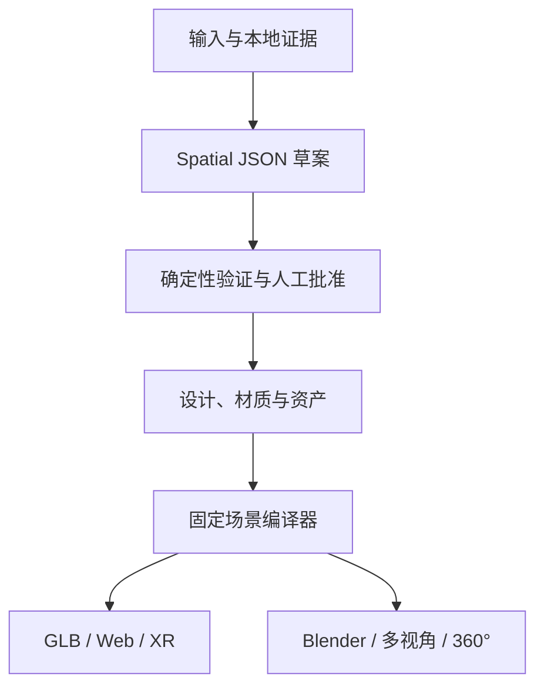
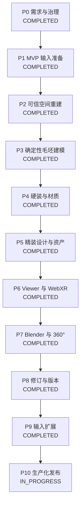

# VR-3D-Skill 产品需求与阶段门禁

## 0. 文档控制

| 项目 | 内容 |
|---|---|
| 文档版本 | 1.5 |
| 文档状态 | P9 已验收，P10 开发中 |
| 更新日期 | 2026-07-24 |
| 代码评估基线 | `gpt_plan` 分支；P2-P9 已完成代码审查和自动化验收 |
| 当前开发阶段 | **P10：生产化、跨平台与发布（IN_PROGRESS）** |
| 下一阶段是否开放 | **无后续开发阶段；P10 未完成前禁止宣称最终发布完成** |

本文件是本项目的产品范围、最终交付、开发阶段和阶段验收门禁的唯一权威文档。

文档职责按以下顺序划分：

1. 本文件定义“最终要做成什么”“当前做到哪里”“何时可以进入下一阶段”。
2. [AI_VR室内设计系统方案设计思路.md](AI_VR室内设计系统方案设计思路.md)解释总体技术架构和模型分工。
3. [SKILL.md](SKILL.md)规定 Agent 执行本 Skill 时必须遵守的行为。
4. `references/`、`schemas/` 和 `scripts/` 分别保存细化流程、数据契约与确定性实现。

如果其他文档与本文件在产品范围或阶段状态上冲突，以本文件为准；如果代码现状与本文件的“当前能力”冲突，以经过测试的代码事实为准，并在同一变更中修正文档。

---

## 1. 产品定义

### 1.1 产品目标

把用户提供的室内设计资料转换为可验证、可修改、可复现、可直接观看的室内 3D/VR 结果。

用户可以提供户型图、CAD、房间照片、扫描数据和装修要求。系统最终应能够：

1. 理解真实空间的尺寸、墙体、门窗、房间、固定设施和连接关系。
2. 将空间事实保存为统一的 `Spatial JSON`，并区分测量、解析、观察、推断和用户修改。
3. 生成毛坯房、硬装房或精装房方案。
4. 生成确定性的 GLB/glTF 场景，并可选生成 Blender 等可编辑工程。
5. 让用户通过桌面、手机、第一人称、WebXR、VR 或 360°全景直观看房。
6. 支持用户用自然语言修改风格、材质、灯光、家具和布局，并保留版本历史。
7. 对尺寸、拓扑、碰撞、动线、来源、隐私、性能和交付范围给出明确验证结果。

### 1.2 核心原则

- `Spatial JSON` 是唯一空间事实源；图片、模型输出和网格都不能越过它直接改变已批准空间。
- 模型负责理解、建议和生成草案；确定性代码负责解析、验证、编译、导出和门禁。
- 人工批准是从“空间草案”进入“设计和场景生成”的必经步骤，模型不得批准自己的输出。
- 本地优先处理原始图纸、照片、地址和客户资料；发送第三方前必须获得明确授权。
- 先完成一个可信、可看的纵向闭环，再扩展输入格式、资产质量和沉浸体验。
- 只有来源、尺度和验证条件满足时才能标记 `construction_ready`；否则必须标记 `visualization_only`。

### 1.3 非目标

本项目不承诺：

- 仅凭一张无尺度图片自动产出可施工、可放样或可采购的精确成果；
- 让大模型为每个用户任务重新生成整套 Three.js、Blender 或后端项目；
- 让图像生成模型、3D 资产模型或已有 GLB 反向决定墙体、门窗和房间拓扑；
- 替代建筑师、结构工程师、机电工程师、消防审查或当地法规验收；
- 在没有真实测量、结构资料和人工复核时判断承重墙或允许拆改；
- 将二维效果图本身当作几何、碰撞、净空或施工依据。

---

## 2. 目标用户与核心场景

### 2.1 目标用户

- 普通业主：快速看到毛坯、硬装和精装后的直观效果。
- 室内设计师：把图纸快速转换为可编辑的空间底模和多个设计方案。
- 房地产、家装和展示团队：生成在线样板间、VR 看房和 360°全景。
- 3D 工程师：获得结构化空间契约、资产清单和可继续加工的 Blender/GLB 成果。
- 平台开发者：把该 Skill 作为完整工作流中的空间理解与 3D/VR 能力模块。

### 2.2 核心用户流程

1. 用户上传一个或多个输入，并说明目标房间、装修模式、风格、预算和观看设备。
2. 系统本地保存原件、计算指纹、识别输入路线并生成证据。
3. 系统生成 `Spatial JSON` 草案，同时列出低置信度事实、冲突和待确认问题。
4. 确定性校验与人工校正完成后，生成与来源哈希绑定的批准记录。
5. 系统基于批准空间生成满足硬约束的功能布局、材质意图和尺寸代理。
6. 固定编译器先生成毛坯或代理 3D 用于几何审阅，并可基于明确设计修订并行生成可选二维视觉预演。
7. 用户批准设计方向后，系统解析真实资产并生成最终硬装或精装场景、Viewer、多视角图、360°全景或 Blender 文件。
8. 用户查看、比较并提出修改；系统只修改受影响对象，重新验证并生成新版本。
9. 系统交付可运行成果、来源追踪、验证报告、限制说明和版本记录。

---

## 3. 输入需求

### 3.1 最终输入范围与当前状态

| 输入 | 最终处理要求 | 当前代码状态 | 计划阶段 |
|---|---|---|---|
| PNG/JPG/JPEG/WebP 户型图 | 本地标准化、OCR、几何提取、尺度锚点、人工校正 | P2 已支持正交闭合外壳、墙体开口、房间轮廓、尺度锚点、像素坐标变换和 2D 人工校正；复杂/非正交拓扑会阻断并要求修正 | P2 |
| DXF | 保留矢量坐标、图层、块、文字、标注和单位；转换为空间语义 | P2 已支持已知单位和图层映射下的闭合房间、墙段、门窗线/块和房间文字确定性转换；未知单位或未闭合拓扑会阻断 | P2 |
| DWG | 经用户批准的本地转换器转换为 DXF，再走 DXF 路线 | P9 已实现 R12–2018+ 文件头校验、无 shell 的批准转换、版本/参数/哈希证据和转换后 DXF 解析 | P9 |
| 矢量 PDF | 提取矢量、文字、尺寸和页面坐标，不先栅格化 | P9 已用本地 Poppler 按页保留 SVG、文字边界框、页面尺寸、旋转和工具版本 | P9 |
| 扫描 PDF | 拆页、纠偏、去噪、OCR、图像几何提取和尺度确认 | P9 已实现扫描/混合页识别、300 DPI 栅格化和标准化；OCR、尺度与几何提取继续走既有本地证据路线并保留阻断 | P9 |
| 单张室内照片 | 相机与透视估计、可见面和固定物识别；缺失几何必须显式推断 | P9 已实现专用证据、尺度门禁和受保护的视觉重建草案任务；结果强制为未批准的 `visualization_only` | P9 |
| 多视角照片/视频 | 相机配准、跨视角一致性、尺度锚点和空间融合 | P9 已验证逐图内参、4×4 位姿、重投影误差和尺度；视频通过本地 FFmpeg/FFprobe 提取带哈希关键帧 | P9 |
| 360°全景照片 | 全景相机模型、房间语义、视角对齐和材质参考 | P9 已验证 2:1 等距柱状投影、尺度和单/多全景对齐边界，缺少位姿时阻断 | P9 |
| 扫描/点云/深度数据 | 点云清理、坐标与尺度统一、平面和开口提取 | P9 已支持 ASCII PLY/PCD/XYZ/PTS、经批准的 PDAL LAS/LAZ/E57 转换和深度反投影；输出轴/尺度/平面/开口候选且永不宣称施工就绪 | P9 |
| IFC/BIM | 保留楼层、构件、分类、属性和单位，映射到 Spatial JSON | P9 已保留 STEP 单位、楼层、构件、包含关系、属性集、分类和墙轴；简单闭合单房间可生成待审草案，复杂几何或跨楼层明确阻断 | P9 |
| GLB/glTF/OBJ/FBX | 作为参考或资产导入，经过尺度、轴、拓扑和来源验证 | P9 已实现 GLB/glTF 结构、边界、语义名和外部资源哈希/路径校验，OBJ 强制单位/轴/手性，FBX 走经批准的本地 GLB 转换 | P9 |
| 文本、表格、预算和产品目录 | 转换为明确的需求、约束、材料和资产候选 | P5 已结构化需求和预算约束；P9 已增加 CSV/TSV/XLSX 产品目录导入、资产尺寸/轴/枢轴/碰撞/许可证门禁 | P5/P9 |

### 3.2 输入处理通用要求

每个输入必须记录：

- 稳定来源 ID、原始文件名、类型、修订号和 SHA-256；
- 文件单位、坐标系、方向、页面或图像方向；
- 是否包含个人数据、地址或客户机密；
- 已执行的本地转换、裁剪、纠偏、缩放和 OCR；
- 原始值与转换值，禁止覆盖原始测量；
- 可作为权威几何的字段，以及只能作为参考的字段；
- 失败原因、缺失依赖、低置信度项和需要人工确认的内容。

原始文件必须保持只读副本。所有转换产物必须可追溯到原始文件和转换参数。

---

## 4. 最终输出与交付物

### 4.1 三种空间结果

| 模式 | 必须包含 | 不得伪装为已完成的内容 |
|---|---|---|
| 毛坯房 `shell` | 墙体、门窗洞口、地面、顶面、层高、房间和固定结构 | 未知结构属性、未经确认的精确尺寸 |
| 硬装房 `hard-furnishing` | 毛坯结果 + 墙地顶材质、踢脚线、固定柜体、厨卫固定设备、灯光意图 | 用颜色块替代已声明的真实 PBR 交付 |
| 精装房 `furnished` | 硬装结果 + 家具、软装、装饰、灯具、布置与动线 | 用代理盒体冒充已解析的真实家具资产 |

### 4.2 每个正式任务的必备交付

- 原始输入清单和 `source-manifest.json`；
- OCR、CAD、图像或扫描证据；
- `spatial-draft.json`、`spatial-approved.json` 和对应版本；
- 结构、拓扑、开口、尺度、碰撞和动线验证报告；
- 与源文件、Spatial JSON 和验证报告哈希绑定的人工批准记录；
- 设计需求、方案、评分、假设、冲突和批准记录；
- 资产清单，包括来源、许可证、尺寸、轴、枢轴、格式和优化状态；
- 确定性的 `scene.glb`/`scene.gltf` 和 `scene-manifest.json`；
- 固定版本的 Web Viewer 和本地启动命令；
- 桌面/移动端查看路径和 WebXR 可用性说明；
- 修订日志、差异、回滚点和受影响的重生成结果；
- 清晰的 `visualization_only` 或 `construction_ready` 范围提示；
- 已测试项、未测试项、剩余风险和失败恢复说明。

### 4.3 按需交付

- 多视角渲染图：入口、客厅、卧室、厨房、卫生间和用户指定机位；
- 等距柱状投影 360°全景图及全景播放器；
- Blender `.blend` 文件、渲染脚本、灯光和相机配置；
- OBJ/FBX/USD 等交换格式；
- 漫游视频、镜头路径和方案对比；
- 家具、材料或设备清单及产品链接；
- 设计说明、估算或提案文档；
- Unreal/Twinmotion 等高质量展示工程。

---

## 5. 功能需求

### 5.1 输入、证据与隐私

| 编号 | 必须实现的需求 |
|---|---|
| FR-IN-001 | 自动识别输入类型并选择确定性处理路线；不支持的输入必须阻断并给出下一步。 |
| FR-IN-002 | 保留原件、指纹、转换参数和来源关系；重复输入应可去重。 |
| FR-IN-003 | 图片预处理必须跨平台、本地运行，并保存方向、尺寸和缩放信息。 |
| FR-IN-004 | DXF、PDF、BIM 和点云优先保留矢量或结构化数据，不得无理由先栅格化。 |
| FR-IN-005 | OCR 只产生带坐标和置信度的证据，不得直接成为几何真值。 |
| FR-IN-006 | 外部模型调用前必须显示供应商、模型、发送文件和隐私范围，并要求明确授权。 |
| FR-IN-007 | API 密钥只能来自被 Git 忽略的本地环境配置，不得进入日志和交付物。 |

### 5.2 空间理解与 Spatial JSON

| 编号 | 必须实现的需求 |
|---|---|
| FR-SP-001 | 统一使用版本化 Spatial JSON 表示单位、轴、原点、来源、房间、墙体、开口、固定设施、设计对象、材料、灯光、XR 和验证状态。 |
| FR-SP-002 | 每个重要对象必须有稳定 ID；修订不得依赖数组下标作为持久标识。 |
| FR-SP-003 | 每个空间事实必须标记为 measured、parsed、observed、inferred、generated 或 user_edited，并记录来源和置信度。 |
| FR-SP-004 | 内部单位统一为米，保留原单位和转换公式；单位未知时不得默认猜测。 |
| FR-SP-005 | 识别墙体、房间、门窗、柱、梁、楼梯、层高变化、固定设备、不可用区域和房间连接。 |
| FR-SP-006 | 生成草案时必须输出假设、冲突和待确认问题；存在阻断问题时不得批准。 |
| FR-SP-007 | 提供 2D 叠加校正能力，让用户修正墙线、开口、房间标签、尺度和方向。 |
| FR-SP-008 | 自动生成源图与标准顶视图的对齐比较和差异报告。 |

### 5.3 验证与批准

| 编号 | 必须实现的需求 |
|---|---|
| FR-QA-001 | 使用正式 JSON Schema 运行时验证和业务几何验证双重校验。 |
| FR-QA-002 | 验证单位、轴、稳定 ID、引用、墙体连接、自交、房间闭合、重复线和零长度线。 |
| FR-QA-003 | 验证门窗属于宿主墙、未越界、未互相重叠，并记录门扇或开启方式。 |
| FR-QA-004 | 验证家具边界、墙体、开口、门扇、固定设施、净空和主要动线。 |
| FR-QA-005 | 冲突测量、未知比例、低置信度拓扑和未回答问题必须形成阻断项。 |
| FR-QA-006 | 批准记录必须绑定源清单哈希、Spatial JSON 哈希、验证报告哈希、批准人、时间、范围和备注，并由外部受信的 Ed25519 审阅者密钥签名。 |
| FR-QA-007 | 模型不得将自己的输出标记为人工批准；批准动作必须由可识别的人在交互终端执行，生产门禁必须拒绝测试批准、无效签名、未知密钥和已撤销密钥。 |
| FR-QA-008 | 纯图片且没有独立可靠尺度的数据只能批准为 `visualization_only`。 |

### 5.4 设计规划

| 编号 | 必须实现的需求 |
|---|---|
| FR-DE-001 | 在审美方案前先生成至少一个满足硬约束的功能布局。 |
| FR-DE-002 | 保留已批准结构和固定设施，并显式处理人数、生活方式、预算、收纳、无障碍和保留物品。 |
| FR-DE-003 | 家具选型前先用真实尺寸占位体和净空区完成可行性验证。 |
| FR-DE-004 | 支持毛坯、硬装、精装和至少两个可比较的设计方案。 |
| FR-DE-005 | 为功能、动线、收纳、采光、风格、成本和风险给出可解释评分。 |
| FR-DE-006 | 视觉预演只能基于已批准空间和已通过硬约束检查的明确设计修订；效果图不得反写空间几何，也不得阻断用于几何审阅的毛坯或代理 3D。 |

### 5.5 材质、灯光与资产

| 编号 | 必须实现的需求 |
|---|---|
| FR-AS-001 | 按客户资产、授权目录、参数化代理、生成资产的顺序解析对象。 |
| FR-AS-002 | 记录资产来源、许可证、真实尺寸、单位、轴、枢轴、材质槽、碰撞代理、面数和纹理预算。 |
| FR-AS-003 | 生成资产仅用于家具和装饰，不得生成墙体、门窗洞口或房间拓扑。 |
| FR-AS-004 | 缺失或无效资产必须保留尺寸正确的代理和可恢复错误，不得静默消失。 |
| FR-AS-005 | 支持 PBR 材质、物理合理参数、色彩空间、UV 尺度、纹理压缩和多质量档。 |
| FR-AS-006 | 支持自然光、基础人工照明、色温、阴影和高质量渲染灯光配置。 |

### 5.6 场景编译与导出

| 编号 | 必须实现的需求 |
|---|---|
| FR-SC-001 | 固定场景编译器必须仅接受通过批准门禁的 Spatial JSON。 |
| FR-SC-002 | 编译器必须正确生成墙体、真实洞口、墙角、地面、顶面、柱梁、楼梯和固定设施。 |
| FR-SC-003 | 同一输入、配置和资产版本必须生成相同的场景哈希。 |
| FR-SC-004 | 一个空间源同时驱动 Web、Blender 和其他导出，不得出现互相独立的几何真值。 |
| FR-SC-005 | 默认输出 GLB/glTF；按需输出 Blender、OBJ、FBX 或 USD，并保存版本和依赖。 |
| FR-SC-006 | 导出前验证网格、法线、UV、材质、尺度、枢轴、包围盒和 glTF 一致性。 |

### 5.7 Viewer、WebXR 与 VR

| 编号 | 必须实现的需求 |
|---|---|
| FR-VR-001 | 固定 Viewer 支持桌面、触摸和主流移动浏览器，不依赖 WebXR 也能完成审阅。 |
| FR-VR-002 | 支持轨道、顶视、第一人称、房间跳转、测量、对象信息、显示切换和方案比较。 |
| FR-VR-003 | WebXR 支持显式进入/退出、重进、暂停、恢复、控制器重连和安全失败。 |
| FR-VR-004 | 默认提供传送和分段转向；平滑移动为可选项，不强制移动或旋转相机。 |
| FR-VR-005 | 生成可行走区域、碰撞体、出生点和传送点，禁止出生在墙体、家具或场景外。 |
| FR-VR-006 | 支持家具选择、替换、移动、旋转、撤销和无效位置反馈。 |
| FR-VR-007 | 保留键盘、鼠标、触摸和屏幕阅读器所需的主要审阅能力。 |

### 5.8 多视角、360°与 Blender

| 编号 | 必须实现的需求 |
|---|---|
| FR-RD-001 | 从同一已批准场景生成可配置的标准机位和用户机位渲染。 |
| FR-RD-002 | 生成符合规范的 2:1 等距柱状投影全景和可直接查看的全景页面。 |
| FR-RD-003 | 支持 Blender 后台模式，自动组装场景、材质、灯光、相机并输出 `.blend` 和渲染。 |
| FR-RD-004 | 每张图记录场景修订、相机、渲染器、质量档、色彩管理和输出哈希。 |
| FR-RD-005 | 高质量渲染与 Web 场景必须共享空间和设计数据，只允许渲染级差异。 |

### 5.9 修改、版本与回滚

| 编号 | 必须实现的需求 |
|---|---|
| FR-RV-001 | 将自然语言修改转换为对稳定 ID 或 RFC 6901 路径的明确操作。 |
| FR-RV-002 | 应用操作前验证基础版本、目标、允许范围和必须保持的对象。 |
| FR-RV-003 | 应用操作后重新验证受影响约束，只重生成依赖产物。 |
| FR-RV-004 | 保存上一版本、差异、批准记录和输出哈希，并支持撤销与回滚。 |
| FR-RV-005 | 结构修改、设计修改和纯视觉修改必须采用不同批准范围。 |

### 5.10 运行、失败恢复与可观测性

| 编号 | 必须实现的需求 |
|---|---|
| FR-OP-001 | 每个任务有稳定 job ID、状态机、幂等键、阶段输出和可恢复检查点。 |
| FR-OP-002 | 对缺失尺寸、转换失败、模型超时、供应商拒绝、无效资产、XR 不支持和性能超标提供明确恢复路线。 |
| FR-OP-003 | 日志记录阶段、耗时、请求 ID、模型、资产版本、哈希和错误码，不记录密钥或未授权客户数据。 |
| FR-OP-004 | 支持本地执行和受控服务部署；外部依赖缺失时尽量保留可审阅的本地产物。 |
| FR-OP-005 | 提供 `doctor`、自动化测试、CI、示例、安装说明和交付检查表。 |

---

## 6. 质量与非功能需求

### 6.1 正确性

- Schema、单位、引用、拓扑和阻断规则必须 100% 通过后才能批准。
- DXF 在单位和图层映射明确的验收样本中，坐标换算后的关键端点误差不得超过 1 mm。
- 带可信尺度锚点的栅格验收样本，主要墙线的中位相对误差目标不超过 2%，最大绝对偏差目标不超过 50 mm；达不到时只能 `visualization_only`。
- 无尺度锚点、冲突未解决或拓扑低置信度的输入不得进入正式设计与场景编译。
- `construction_ready` 必须同时具备权威测量来源、严格阈值、人工批准和用途限制，不能由模型置信度替代。

### 6.2 确定性与可复现

- 相同输入、配置、代码和资产版本应生成相同 Spatial JSON 规范化哈希和场景哈希。
- 每个产物必须可追溯到输入、修订、脚本版本、模型请求和资产版本。
- 外部模型结果不可重现时，必须保留原始响应元数据、解析结果和人工批准版本。

### 6.3 性能

- Viewer 必须渐进加载，并显示加载、失败和降级状态。
- 桌面审阅目标为 60 FPS，最低可接受为稳定 30 FPS。
- XR 必须以目标设备刷新率为性能门槛，并记录真实设备帧时间；不得只用桌面结果推断。
- 为 Web、移动和高质量渲染分别配置多边形、纹理、显存、灯光、阴影和下载体积预算。
- 运行过程中不得出现持续内存增长、重复事件监听或重复渲染循环。

### 6.4 兼容性与可访问性

- 核心 Node.js 工具最终须在 Windows、macOS 和 Linux 的受支持版本通过 CI。
- Viewer 必须在主流 Chromium 桌面和移动端完成非 XR 核心流程。
- 关键状态不能只依赖颜色表达；交互必须有焦点、选中、碰撞、不可用和错误反馈。
- XR 不可用、HTTPS 不满足或权限被拒绝时，必须保留桌面审阅路径。

### 6.5 安全与隐私

- 默认本地处理原始图纸、照片、地址和客户元数据。
- 每次外部发送都必须有数据范围明确的授权，不允许用一次授权覆盖未来未知数据。
- 提交、日志、错误、Viewer 和交付包中不得包含密钥、鉴权头或不必要的个人数据。
- 资产必须记录许可证；许可证未知的资产不得默认公开分发。

### 6.6 测试

- 每个阶段必须包含正常、边界和失败用例。
- 几何算法、输入路由、Schema、修订、场景哈希和 GLB 解析必须自动化测试。
- Viewer 和 XR 生命周期必须有浏览器/设备验证记录。
- 真实样本必须去除敏感信息；合成样本要覆盖多房间、凹多边形、共享墙、多个开口和异常输入。

---

## 7. 目标架构与产物结构

### 7.1 数据流



GPT Image 2 等视觉模型只能从已批准空间和通过设计硬约束检查的明确修订生成二维预演；预演结果不能回写 C 之前的空间事实，也不是毛坯或代理 3D 几何审阅的强制前置条件。工程模型只能扩展固定工具、测试和运行时，不能为每个任务重新生成整个系统。

### 7.2 每个任务的目标目录

```text
runs/<job-id>/
  inputs/                       # 原始输入只读副本
  evidence/                     # OCR、DXF、PDF、图像和扫描证据
  source-manifest.json
  job.json
  spatial/
    draft.json
    approved.json
    validation-report.json
    top-view.png
    alignment.json
    alignment-diff.png
  approval/
    spatial-approval.json
    spatial-approval-trust.json # 公开信任快照，不含私钥
  design/
    proposal-001.json
    revision-log.json
  assets/
    asset-manifest.json
    *.glb
  scene/
    scene.glb
    scene-manifest.json
    spatial.json
    validation-report.json
  viewer/
    index.html
    app.js
    styles.css
  renders/
    views/
    panoramas/
    blender/
  audit/
    events.jsonl
    delivery-report.json
```

`runs/` 默认不提交 Git。正式验收所需的非敏感固定样本放在 `examples/` 或测试夹具目录，验收报告可放在 `runs/acceptance/<阶段>/` 或外部 CI 产物中。

---

## 8. 严格阶段门禁

### 8.1 状态定义

| 状态 | 含义 |
|---|---|
| `NOT_STARTED` | 前置阶段未完成，尚未开始。 |
| `BLOCKED` | 已有想法或原型，但前置门禁未开放，禁止正式开发。 |
| `IN_PROGRESS` | 当前唯一允许进行功能开发的阶段。 |
| `ACCEPTANCE` | 功能已冻结，只允许修复验收问题和补证据。 |
| `COMPLETED` | 所有必选项、测试、证据和人工验收均已完成。 |

### 8.2 不可绕过规则

1. 任意时刻最多只有一个阶段为 `IN_PROGRESS` 或 `ACCEPTANCE`。
2. 当前阶段不是 `COMPLETED` 时，不得把下一阶段改为 `IN_PROGRESS`，不得以“先做一点”“已有代码”“模型认为可行”为由越级。
3. 后续阶段已有的代码只能标记为**预研原型**并冻结；它不计入正式阶段完成度，也不能成为跳过门禁的理由。
4. 阶段完成必须同时满足：
   - 本阶段所有强制验收项已勾选；
   - 自动化测试、静态检查和必要的真实设备/人工测试通过；
   - 验收证据可定位；
   - 未关闭阻断项为 0；
   - 人工验收结论已记录；
   - 本文件的状态表和证据链接在同一提交中更新。
5. `ACCEPTANCE` 被拒绝时必须退回 `IN_PROGRESS`，不得继续下一阶段。
6. 百分比、代码量、演示截图和下游原型都不能替代 `COMPLETED` 状态。
7. 安全漏洞、数据损坏和阻断当前阶段的跨阶段基础修复可以例外处理，但只能做最小修复，不算开启后续阶段。
8. 若产品范围改变，必须先修改本需求文档并获得确认，再重新评估阶段；不能靠口头指令暗中绕过门禁。

### 8.3 阶段切换记录要求

每次切换至少记录：

- 阶段 ID、进入和完成时间；
- 基线与验收提交；
- 强制验收清单；
- 自动化测试、样本、设备和人工审阅证据；
- 未完成的非阻断项；
- 批准人和结论；
- 下一阶段是否开放。

---

## 9. 开发阶段与当前进度

### 9.1 总览

门禁进度为：**P0-P9 已完成，P10 正在开发。当前只允许 P10 生产化、跨平台资格和发布验收工作。**



| 阶段 | 正式状态 | 当前事实 | 是否允许开发 |
|---|---|---|---|
| P0 需求、契约与治理 | `COMPLETED` | 已有总体架构、Spatial JSON 契约，本文件建立范围和门禁，SKILL 将强制读取 | 已完成 |
| P1 MVP 输入准备 | `COMPLETED` | 图片路由/标准化、可选本地 OCR、DXF 矢量证据、来源清单、任务准备和测试已存在 | 已完成 |
| **P2 可信空间重建与批准链** | **`COMPLETED`** | 12/12 项、10 个固定样本、独立技术复核和产品负责人接受结论均已记录 | 已完成 |
| **P3 确定性毛坯建模与 GLB** | **`COMPLETED`** | 7/7 项、20 个固定样本、墙体拓扑/GLB/顶视对齐证据和产品负责人验收均已记录 | 已完成 |
| **P4 硬装与材质管线** | **`COMPLETED`** | PBR、硬装、材质替换、纹理/灯光、20 样本与性能审计已通过代码验收 | 已完成 |
| **P5 精装设计与真实资产** | **`COMPLETED`** | 结构化需求、两方案比较、布局/动线/门口净空和目录资产/代理闭环通过 20 样本验收 | 已完成 |
| **P6 生产级 Viewer 与 WebXR** | **`COMPLETED`** | 统一 Viewer、导航/碰撞、编辑/测量/注释、生命周期和设备合同通过 20 样本验收 | 已完成 |
| **P7 Blender、多视角与 360°** | **`COMPLETED`** | 后台渲染、多机位、2:1 全景、播放器、可选视频、版本/哈希和恢复合同通过 20 样本验收 | 已完成 |
| **P8 自然语言修订与版本** | **`COMPLETED`** | 受限自然语言规划、真实补丁应用、增量依赖、重批准、差异/撤销/回滚和哈希审计通过 20 样本验收 | 已完成 |
| **P9 全输入扩展** | **`COMPLETED`** | 11 类输入共 33 个正常/边界/失败样本通过；真实 Poppler/FFmpeg、转换门禁、来源哈希和质量降级均已验证 | 已完成 |
| **P10 生产化、跨平台与发布** | **`IN_PROGRESS`** | 正在补齐任务运行时、跨平台 CI、诊断、安全、迁移、性能资格、文档和发布验收 | **仅允许 P10 工作** |

### 9.2 P0：需求、契约与治理

目标：确定产品边界、架构原则、统一数据契约、开发顺序和不可绕过门禁。

完成证据：

- 本文件；
- [SKILL.md](SKILL.md)；
- [AI_VR室内设计系统方案设计思路.md](AI_VR室内设计系统方案设计思路.md)；
- [references/spatial-json-contract.md](references/spatial-json-contract.md)；
- [schemas/spatial.schema.json](schemas/spatial.schema.json)。

状态：`COMPLETED`。

### 9.3 P1：MVP 输入准备

目标：在不依赖云端模型的情况下准备图片和 DXF 输入，保留原件与证据。

已通过：

- 图片、DXF、DWG、PDF、JSON、GLB/glTF 和 IFC 路由识别；
- PNG/JPG/JPEG/WebP 跨平台标准化；
- 可选本地 Tesseract OCR；
- DXF 图层、单位、实体、块、文字和尺寸证据提取；
- 来源清单、SHA-256、任务目录和阻断提示；
- 图片与 DXF 路线自动化测试。

范围限制：P1 的“完整支持”只包括图片准备和 DXF 证据提取；DWG、PDF、IFC 和已有场景仍是显式阻断路线。

状态：`COMPLETED`。

### 9.4 P2：可信空间重建与人工批准链

目标：将图片或 DXF 可靠转换为可校正、可验证、可批准的 Spatial JSON。

当前检查清单：

- [x] 建立 Spatial JSON v1.0 Schema、单位、轴和稳定 ID 基线。
- [x] 建立基于来源清单、OCR/CAD 证据和授权开关的空间草案入口。
- [x] 校验墙体零长度、房间连接、闭合和自交。
- [x] 校验门窗宿主、墙内范围、墙高范围和开口重叠。
- [x] 校验设计对象房间引用、基本边界和代理碰撞。
- [x] `requireApproved` 会阻断未批准状态、未知批准范围和未解决问题。
- [x] 接入正式 JSON Schema 运行时验证，不再只依赖手写校验器。
- [x] 完成 DXF 实体/图层/块到墙体、门窗和房间的确定性语义映射。
- [x] 完成栅格图的墙线、开口、房间轮廓和尺度锚点提取与校正流程。
- [x] 生成绑定来源、Spatial JSON、验证报告、批准人、时间和范围的批准文件。
- [x] 建立至少 10 个固定验收样本：不少于 5 个栅格图和 5 个 DXF。
- [x] 生成源图与标准顶视图对齐报告，并支持人工修正后重验。

P2 强制通过条件：

1. 上述 12 项全部完成。
2. 所有固定样本 Schema 和几何错误为 0。
3. DXF 与带尺度栅格样本满足第 6.1 节误差要求。
4. 无可靠尺度的栅格结果自动限制为 `visualization_only`。
5. 未解决问题、来源冲突、单位未知和低置信度拓扑均能阻断批准。
6. 人工批准文件不能由空间模型自行生成或伪造。
7. 自动化测试与 CI 全部通过。
8. 本文件记录验收提交、证据和批准人后，P2 才能改为 `COMPLETED`。

P2 验收候选证据：

| 证据 | 结果 |
|---|---|
| [examples/p2-acceptance/automated-evidence.json](examples/p2-acceptance/automated-evidence.json) | 5 个栅格 + 5 个 DXF；Schema/几何错误 0 |
| DXF 精度 | 5 个样本最大关键端点误差 0 m，门窗宽度误差 0 m，门槛 0.001 m |
| 栅格精度 | 主要墙线中位相对误差 0，最大绝对误差 0 m；门槛分别为 2% 和 0.05 m |
| 顶视对齐 | 5 个栅格样本最低 F1 0.956079，最低 IoU 0.915854；包含经人工修正数据重验的 L 形样本 |
| 无可信尺度降级 | `raster-05-estimated-scale` 自动为 `visualization_only` |
| 自动化检查 | `npm run check`：44 个脚本语法检查、26 个离线测试全部通过；`npm run doctor` 的 P2 空间与对齐就绪项通过 |
| 人工校正 | `assets/spatial-review/` 支持源图叠加、共享墙角拖动、开口/房间/尺度/范围修正和导出重验 |
| 批准隔离 | 生产 CLI 不接受测试批准；人工批准只能由交互 TTY 命令生成，绑定三份输入哈希，并由外部受信 Ed25519 审阅者密钥签名 |
| 人工验收 | 产品负责人 Senk 授权“P2 无阻断问题即开始 P3”；独立复核确认批准隔离、篡改检测、尺度降级、10 个固定样本与全量测试均通过 |
| 验收提交 | `gpt_plan`：`1576e6fd7c4b4850f24e5d01d3a509721a1619f1` |

当前进度：12/12 项已实现，状态为 `COMPLETED`。

### 9.5 P3：确定性毛坯建模与 GLB

开放前置：P2=`COMPLETED`。

强制成果：

- 多房间、凹房间、共享墙和复杂墙角；
- 真实墙洞、门窗、地面、顶面、柱、梁、楼梯和层高变化；
- 从批准 Spatial JSON 到 GLB 的确定性编译；
- 正确单位、轴、法线、UV、材质槽和包围盒；
- GLB/glTF 一致性验证和不少于 20 个几何回归样本；
- 来源顶视对齐、场景哈希和失败报告。

P3 当前检查清单：

- [x] 扩展 Spatial JSON：房间独立楼板/顶面标高，以及柱、梁、楼梯的确定性描述。
- [x] 编译房间地面、顶面、门窗洞口、柱、梁、楼梯和尺寸代理的基础毛坯几何。
- [x] 为 GLB 写入位置、法线、UV、坐标系元数据和访问器包围盒，并在写入后验证 GLB 二进制结构。
- [x] 处理多房间、凹房间、共享墙和复杂墙角的无重叠/无裂缝网格：普通转角使用斜接墙体；T/X 交点使用确定性贯通墙与支墙贴面；共线重叠墙段先切分再去重，并检测未解析交点与墙体体积重叠。
- [x] 覆盖楼板高差、楼梯衔接和结构构件描述的几何验证。
- [x] 建立 20 个 P3 几何回归样本及 GLB/glTF 一致性报告。
- [x] 建立从 Spatial 源顶视图到已编译毛坯场景的对齐、场景哈希和结构化失败报告。

P3 验收证据与结论：

| 证据 | 结果 |
|---|---|
| [examples/p3-acceptance/automated-evidence.json](examples/p3-acceptance/automated-evidence.json) | 20 个固定样本；Spatial、GLB、墙体拓扑、计数错误均为 0；最低顶视对齐 F1 为 0.938824、IoU 为 0.884702；每个样本均有稳定场景哈希 |
| 自动化检查 | `npm run check`：49 个脚本语法检查、32 个离线测试全部通过；`npm run p3:acceptance` 通过 |
| 代码复核 | 普通转角斜接、T/X 贯通墙与支墙贴面、共线墙段切分去重，以及墙体体积重叠/未解析交点阻断均已复核；未关闭阻断项为 0 |
| 人工验收 | 产品负责人 Senk 于 2026-07-24 授权通过 P3，并开放 P4 |
| 验收提交 | `gpt_plan`：`bc54f9749beb6a1eca3220e93b65de6d4001fed8` |

状态：`COMPLETED`。

### 9.6 P4：硬装与材质管线

开放前置：P3=`COMPLETED`。

强制成果：

- 墙、地、顶分面与材质绑定；
- 踢脚线、门套、窗套、吊顶、固定柜体和厨卫固定设备；
- PBR 材质、UV 实际尺度、纹理压缩和颜色空间；
- 自然光、基础灯光和质量档；
- 材质替换、缺失纹理降级和 Web/Blender 一致性。

P4 当前检查清单：

- [x] 扩展可追溯的 PBR 材质与纹理契约，并验证颜色空间、UV 实际尺度、纹理预算和降级策略（20 个 P4 样本通过）。
- [x] 将墙、地、顶分面与材质稳定绑定，并在 GLB 中输出对应 PBR 槽位。
- [x] 编译踢脚线、门套、窗套、吊顶、固定柜体和厨卫固定设备，保持与 Spatial JSON 的来源绑定。
- [x] 建立自然光、基础灯光和质量档的确定性描述与 Viewer/GLB 降级规则。
- [x] 支持材质替换与缺失纹理降级，并生成结构化验证报告（P4 纹理回归已覆盖；阶段整体仍未验收）。
- [x] 建立 Web 与 Blender 导出的一致性契约及不少于 20 个 P4 回归样本（仅为 P4 glTF 导入契约；实际 Blender 后台/渲染仍属于 P7）。
- [x] 记录性能、纹理内存和材质槽验证证据，并完成本次授权下的独立代码验收（60 个审计样本通过）。

P4 当前已实现的基础能力（尚未满足全部阶段验收，不能解除后续门禁）：

- `materials` 已支持 PBR 纹理槽、颜色空间、实际铺贴尺度、纹理预算、透明/双面和自发光元数据；验证器会阻断不符合 sRGB/线性色彩空间约定和无效铺贴尺度的输入。
- `hard_finishes` 已支持稳定 ID 绑定的踢脚线、门窗套、吊顶、固定柜体和固定设备，并确定性写入 GLB。
- 场景编译会把相对本地纹理或数据 URI 压缩为 WebP 后嵌入 GLB；KTX2 保持原格式。缺失、绝对路径或网络纹理会生成确定性 1×1 回退纹理，并在 `texture-validation-report.json` 中记录来源、哈希、状态和原因。
- `lights` 会以 `KHR_lights_punctual` 写入 GLB，支持自然光/方向光、点光、聚光和区域光降级；`draft`、`standard`、`presentation` 三档控制纹理尺寸、压缩质量和灯光倍率，并记录在场景清单。
- `npm run p4:acceptance` 已固定 20 个 P4 样本，验证 Spatial/GLB、PBR 嵌入纹理、缺失纹理回退、硬装构件、`KHR_lights_punctual`、纹理预算、材质替换绑定和 Blender glTF 导入契约。它不调用 Blender，因而不越过 P7 门禁。
- 性能审计位于 `examples/p4-acceptance/performance-audit.json`：20 个空间样本 × 3 个质量档，预算和材质槽错误均为 0；最大 GLB 为 43040 bytes、最大嵌入纹理为 112 bytes。该证据是可重复的代码/产物审计，不声称为物理 XR 设备帧率测试。

验收记录：Senk 于 2026-07-24 授权由 Codex 进行独立代码审查和自动化验收；`npm run check`、`npm run p3:acceptance`、`npm run p4:acceptance` 与 `npm run p4:audit` 通过，未发现 P4 阻断项。

状态：`COMPLETED`。

### 9.7 P5：精装设计与真实资产

开放前置：P4=`COMPLETED`。

强制成果：

- 需求、预算、使用者和保留物品的结构化输入；
- 功能分区、家具布局、净空、门扇、碰撞和连续动线；
- 至少两个可解释、可比较的方案；
- 目录资产优先、授权资产库、3D 生成兜底；
- 资产尺寸、轴、枢轴、许可证、碰撞体和优化验证；
- 精装结果中真实资产与代理资产必须明确区分。

P5 验收结果：

- [x] 结构化预算、使用者、活动、最低净空和保留物品输入。
- [x] 至少两个带功能分区、成本、风险和三维评分的可比较方案。
- [x] 家具碰撞、房间边界、连续动线和门口净空阻断。
- [x] 客户资产、授权目录和生成资产的确定性优先级。
- [x] GLB 格式、米制单位、轴、枢轴、许可证、碰撞代理和优化状态验证。
- [x] 真实资产与尺寸代理在结果和警告中明确区分。

自动化证据位于 `examples/p5-acceptance/automated-evidence.json`：20 个固定样本，设计、资产解析、方案比较和已选真实资产错误均为 0。Senk 已授权 Codex 独立代码审查与自动化验收；全仓 39 个测试以及 P2-P5 验收命令全部通过，未发现 P5 阻断项。

状态：`COMPLETED`。

### 9.8 P6：生产级 Viewer 与 WebXR

开放前置：P5=`COMPLETED`。

强制成果：

- 桌面、移动端和 WebXR 统一 Viewer；
- 轨道、顶视、第一人称、房间跳转、测量、注释和方案比较；
- 导航网格、碰撞、出生点、传送、分段转向和舒适性设置；
- 家具选择、替换、移动、旋转、撤销和无效位置反馈；
- XR 进入、退出、重进、暂停、恢复、失焦和控制器重连；
- 可访问性、渐进加载、性能档和真实设备测试。

P6 验收结果：

- [x] 桌面、移动和 WebXR 共用同一 GLB、Manifest 和运行时合同。
- [x] 轨道、顶视、第一人称、房间跳转、测量、注释和方案交互入口。
- [x] 房间导航多边形、家具障碍物、出生点、传送和分段转向合同。
- [x] 家具选择、移动、旋转、撤销与无效位置反馈。
- [x] XR 进入/退出、暂停/恢复、失焦和控制器断开/重连状态。
- [x] 键盘、状态播报、触控尺寸、减少动态效果和质量档。

自动化证据位于 `examples/p6-acceptance/automated-evidence.json`：20 个固定样本，运行时和 Viewer 合同错误均为 0。物理头显与控制器帧率没有在无设备环境中伪造，明确保留为 P10 目标硬件发布资格测试；P6 的实现与代码合同经独立审查无阻断项。

状态：`COMPLETED`。

### 9.9 P7：Blender、多视角与 360°全景

开放前置：P6=`COMPLETED`。

强制成果：

- Blender 后台场景组装、材质、灯光和相机；
- 标准房间机位和用户自定义机位；
- 2:1 等距柱状投影 360°全景与播放器；
- 高质量静帧、可选漫游视频和 `.blend`；
- 渲染版本、配置、色彩管理、哈希和失败恢复。

P7 验收结果：

- [x] 从同一批准场景生成确定性的 Blender 后台渲染计划。
- [x] 自动生成总览、逐房间和用户自定义相机及 1080p 静帧配置。
- [x] 输出 4096×2048 等距柱状投影全景及独立 Three.js 全景播放器。
- [x] 支持 `.blend` 保存和可选 H.264/MPEG-4 漫游渲染路径。
- [x] 采用 Eevee Next 与 AgX 色彩管理，并兼容 Blender look 名称差异。
- [x] 原子检查点保留状态历史，失败任务可重跑，匹配计划的已完成任务可幂等复用。
- [x] 生产清单记录实际 Blender 版本、渲染计划哈希和每个交付物的 SHA-256。

自动化证据位于 `examples/p7-acceptance/automated-evidence.json`：20 个固定样本的相机、静帧、全景、视频和恢复合同错误均为 0。无 Blender 二进制的测试环境没有伪造真实渲染；通过可执行假后端覆盖编排、版本采集、逐产物哈希与幂等恢复，实际 Blender 和目标 GPU 的渲染资格保留在 P10 发布矩阵。

状态：`COMPLETED`。

### 9.10 P8：自然语言修订、增量生成与版本

开放前置：P7=`COMPLETED`。

强制成果：

- 自然语言到稳定 ID 修订操作；
- 修改范围、基础版本和保留条件验证；
- 真正应用补丁，而不只是验证补丁格式；
- 依赖图和受影响产物的增量重生成；
- 差异展示、撤销、回滚、重新批准和审计记录。

P8 验收结果：

- [x] 受保护的模型任务把自然语言转换为带显式作用域的稳定 ID 修订提案，且不会直接应用模型输出。
- [x] 验证基础版本、允许作用域、稳定 ID、耐久 JSON Pointer、保留对象/路径、来源和回滚引用。
- [x] 确定性引擎真正执行 `add/remove/replace/test`，阻断数组下标、受控元数据、越权和失败前置条件。
- [x] 每次应用都重跑 Spatial JSON 验证、生成结构化差异与反向修订，并把批准状态降为待重新批准。
- [x] 依赖图只列出受影响验证和产物；增量执行器只运行已注册处理器，复用未受影响哈希，并在重新批准前阻断下游生成。
- [x] 文件版本库使用互斥锁、原子 JSON 写入、不可穿越路径、版本哈希和哈希链审计，支持撤销、历史快照回滚及撤销回滚。

自动化证据位于 `examples/p8-acceptance/automated-evidence.json`：20 个固定样本的应用、差异、反向操作、依赖、批准失效和审计错误均为 0；越权修改及保留条件破坏均被阻断。全仓 49 项测试通过，包括自然语言规划的离线替身、版本篡改检测和重新批准前的增量生成阻断。

状态：`COMPLETED`。

### 9.11 P9：全输入扩展

开放前置：P8=`COMPLETED`。

强制成果：

- DWG 本地转换路线；
- 矢量 PDF 与扫描 PDF 分流；
- IFC/BIM 语义映射；
- 室内照片、多视角、视频和 360°参考；
- 扫描、点云和深度数据融合；
- 已有 GLB/glTF/OBJ/FBX 的语义重建与资产导入；
- 每种输入的固定样本、失败路线和质量门禁。

P9 验收结果：

- [x] DWG R12–2018+ 通过显式批准的本地转换器进入 DXF 证据路线，记录转换器版本、参数占位符、输入/输出哈希并拒绝伪文件。
- [x] 本地 Poppler 按页区分矢量、扫描、混合和空白 PDF，保留 SVG、文字边界框、页面坐标与扫描页标准化产物。
- [x] IFC STEP 证据保留单位、楼层、构件、包含关系、属性集和分类；简单闭合墙轴映射为待批准草案，复杂/跨层数据安全阻断。
- [x] 单图、多视角、视频和 360°输入执行分辨率、投影、去重、相机配准、重投影误差和尺度门禁；模型任务验证图片哈希并清除所有嵌套本地路径。
- [x] ASCII 点云、深度反投影及经批准的 PDAL 二进制扫描转换保留轴、尺度、边界、平面和开口候选；统一限制为 `visualization_only`。
- [x] GLB/glTF/OBJ/FBX 路线验证结构、边界、语义候选、资源哈希、路径穿越、单位、轴、手性、资产 ID、许可证及本地转换证据。
- [x] CSV/TSV/XLSX 产品目录验证尺寸、单位、枢轴、前向轴、碰撞代理、优化状态、来源和许可证。
- [x] 统一任务准备器可处理上述输入及直接 Spatial JSON，并把缺少可选工具、尺度、配准、转换批准或复杂几何转换为结构化阻断项。
- [x] 11 类输入各有正常、边界和失败样本，共 33 个固定门禁样本；另有真实 Poppler、真实 FFmpeg、转换替身、资源安全和工作流集成测试。

自动化证据位于 `examples/p9-acceptance/automated-evidence.json`：33 个固定样本、11 类输入、每类 3 个用例，路线错误为 0。全仓 62 项测试全部通过。真实 Poppler 和 FFmpeg 在本轮环境中完成集成测试；DWG、PDAL 和 FBX 通过无 shell 的可执行转换替身验证批准、版本、参数、产物和失败边界。未安装的可选本地工具只影响相应输入路线，并由 `doctor` 与任务阻断明确报告，不会被伪装为已执行。

产品负责人已明确授权本轮按门禁自动审查、验收并连续推进；代码审查和自动化证据未发现 P9 阻断项，接受结论为通过。P10 同步开放。

状态：`COMPLETED`。

### 9.12 P10：生产化、跨平台与发布

开放前置：P9=`COMPLETED`。

强制成果：

- Windows、macOS、Linux 安装与 CI；
- 完整 `doctor`、依赖检查、升级和迁移；
- 任务状态机、幂等、重试、检查点和可观测性；
- 隐私、安全、许可证、敏感数据和密钥审计；
- Web、移动、XR 和 Blender 性能预算与基准；
- 示例、用户指南、故障排查、验收报告和发布包；
- 端到端真实项目验收与正式版本标签。

状态：`IN_PROGRESS`。

---

## 10. 当前迭代边界

P10 处于 `IN_PROGRESS` 期间，只允许：

- 完善 Windows、macOS、Linux CI、安装诊断、迁移和发布打包；
- 完善任务状态机、幂等、重试、检查点、日志和可观测性；
- 执行隐私、安全、许可证、敏感数据、密钥与依赖审计；
- 建立 Web、移动、XR、Blender 的性能预算、可执行基准和目标硬件资格记录；
- 完成示例、用户指南、故障排查、端到端验收报告和版本发布门禁；
- 修复 P0-P10 验收发现的阻断问题。

在 P10 完成前，禁止：

- 宣称仓库已经完成正式生产发布或全部目标硬件资格；
- 用桌面模拟、合同测试或未执行的工具结果冒充物理 XR、目标 GPU、真实 Blender 或跨系统执行证据；
- 跳过安全、许可证、来源、批准或性能阻断发布。

下一次允许的状态变化只有：

1. P10 验收失败：`P10: ACCEPTANCE -> IN_PROGRESS`；或
2. P10 所有代码与可执行资格门禁通过：`P10: ACCEPTANCE -> COMPLETED`。

若目标物理设备、操作系统或外部工具在当前环境不可用，必须生成明确的待执行资格清单并保持对应发布资格为未通过，不能伪造证据。

---

## 11. 最终产品验收定义

当 P0-P10 全部 `COMPLETED` 时，本 Skill 才可宣称达到最终目标。最终验收必须证明：

1. 用户可以从至少一种栅格户型图和一种 CAD 路线开始，无需手工编写 Spatial JSON。
2. 系统可以发现不确定性，让用户校正，并阻止未经批准的空间进入设计和建模。
3. 同一批准空间可以产出毛坯、硬装和精装三种可区分结果。
4. 用户可在桌面和移动端直接查看，并在受支持设备进入 WebXR/VR。
5. 系统可生成多视角图和 360°全景，并可按需提供 Blender 工程。
6. 家具、材质、灯光、碰撞、动线、资产来源和许可证均可追踪。
7. 用户可以自然语言修改结果、查看差异、撤销、回滚并重新批准。
8. 所有正式交付都包含来源、哈希、验证、批准范围、限制和运行说明。
9. Windows、macOS、Linux、Web 和目标 XR 设备的验收证据完整。
10. 任何无法保证的尺寸、结构、法规或施工结论都被明确标注，绝不以视觉效果替代事实。
